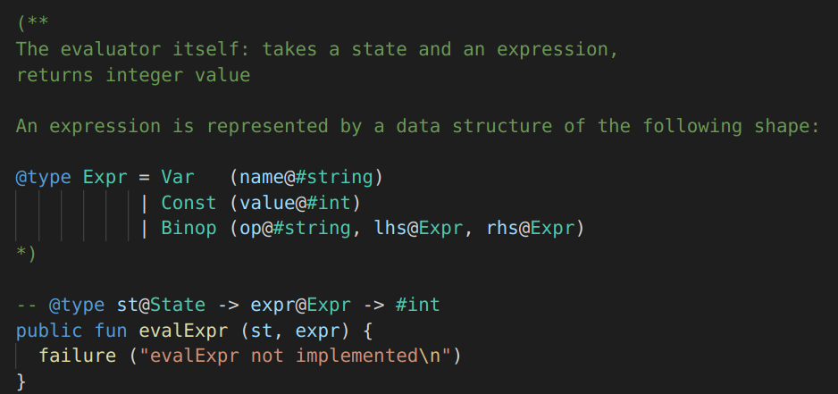

# Lama Language extension for VSCode

An extension for Visual Studio Code that adds some basic editing features such as syntax highlighting, code folding, snippets and syntax checking for the [Lama](https://github.com/JetBrains-Research/Lama) language.

## Features

- Syntax highlighting

  

- Type definitions (only highlighting for now)

  

- Code snippets

  

- Syntax validation

  

## Development

- Run `npm install` in this folder. This installs all necessary npm modules in both the client and server folder
- Open VS Code on this folder.
- Press Ctrl+Shift+B to compile the client and server.
- Switch to the Debug viewlet.
- Select `Launch Client` from the drop down.
- Run the launch config.
- If you want to debug the server as well use the launch configuration `Attach to Server`
- In the [Extension Development Host] instance of VSCode, open a *.lama source file.

## License

Lama Language extension is released under the [MIT License](LICENSE).
